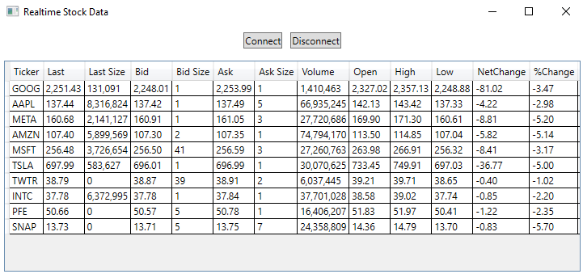

# Realtime Stock Data Using Signalr
This project showcases the realtime data service from [Tallac Options](wwww.tallacoptions.com). It creates a basic dashboard to fetch live stock quotes.



# Specifications
- **Project Type**: WPF App
- **Target Framework**: .NET 6.0
- **Dependencies**: Microsoft.AspNetCore.SignalR.Client 6.0.5

# Usage
- Customize the list of stocks (add or remove items)
- Build and run the App
- Click the **Connect** button to start streaming live data
- Click the **Disconnect** button to stop

# How It Works

#### Step 1 ####
Create a list of stocks

```csharp
Stocks = new ObservableCollection<Stock>
            {
                new Stock("GOOG"),
                new Stock("AAPL"),
                new Stock("META"),
                new Stock("AMZN"),
                new Stock("MSFT"),
                new Stock("TSLA"),
                new Stock("TWTR"),
                new Stock("INTC"),
                new Stock("PFE"),
                new Stock("SNAP")
            };
```

#### Step 2 ####
Set up Hub connection

```csharp
_connection = new HubConnectionBuilder()
                .WithUrl("https://tallacoptions.com/livehub")
                .Build();
```


#### Step 3 ####
Register your handlers

```csharp
_connection.On<QuoteItem>("Open", UpdateOpen);
            _connection.On<QuoteItem>("High", UpdateHigh);
            _connection.On<QuoteItem>("Low", UpdateLow);
            _connection.On<QuoteItem>("Volume", UpdateVolume);
            _connection.On<QuoteLast>("Last", UpdateLast);
            _connection.On<QuoteItem>("LastSize", UpdateLastSize);
            _connection.On<QuoteItem>("Bid", UpdateBid);
            _connection.On<QuoteItem>("BidSize", UpdateBidSize);
            _connection.On<QuoteItem>("Ask", UpdateAsk);
            _connection.On<QuoteItem>("AskSize", UpdateAskSize);
```

# Limitations
- TallacOptions-API doesn't cover all [instruments](https://www.tallacoptions.com/instruments). Before you add a new ticker, make sure it's covered.
- The realtime data service operates on trading days and hours.
- The connection goes idle after a while. Authentication and authorization are required for persistant connections.
